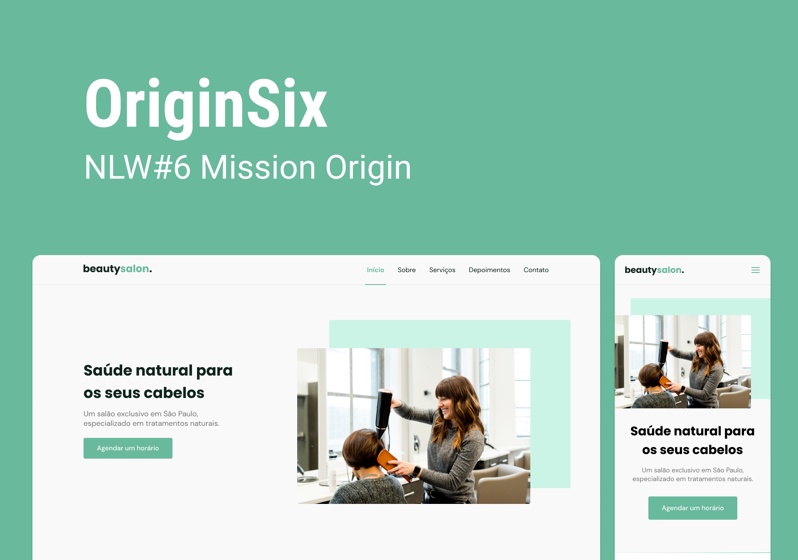

  

## 💻 Projeto

OriginSix é uma página institucional no formato One Page, responsiva, podendo ser utilizada como modelo de página web para pequenas e médias empresas. Contém as seguintes seções: Header, Navigation, Home, Sobre, Serviços, Depoimentos, Contato e Footer

## ✨ Tecnologias

- [ ] HTML
- [ ] CSS
- [ ] JavaScript

## :hammer_and_wrench: Features

- [ ] Google fonts
- [ ] SwipeJs
- [ ] ScrollRevel
- [ ] randomuser
- [ ] iconMoon

## 🔖 Layout

Você pode visualizar o layout do projeto através do [Figma](https://www.figma.com/community/file/1009807319507822993).

**&copy; [Rocketseat](https://rocketseat.com.br/)**

**Instrutor: [Mayk Brito](https://github.com/maykbrito) | Instructor & Content Producer at Rocketseat**

---

<h4 align="center">by <a href="https://github.com/JoseAAAM" target="_blank">JoseAAAM</a> </h4>
